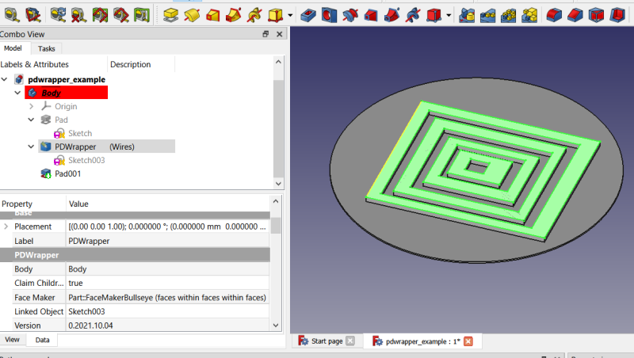
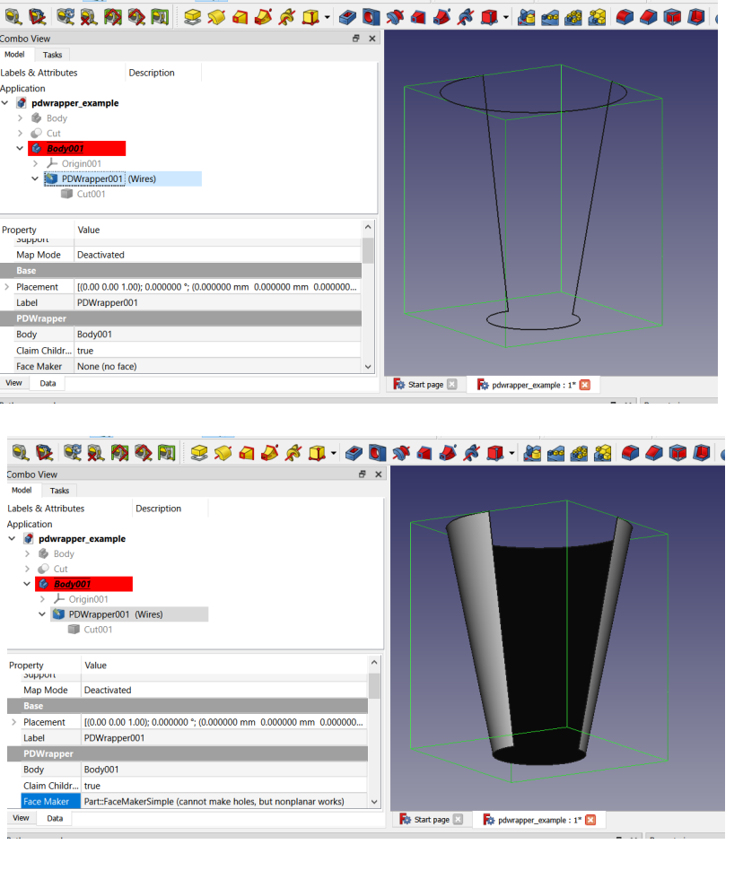

### This document (and this macro) is still under construction

# PDWrapper
Part Design Wrapper object.  Encapsulates objects created outside Part Design for use inside Part Design bodies in FreeCAD.  For example, if you wish to use a Part workbench primitive, such as a Tube object in a Part Design model you can add it to the active body by selecting it and running the macro.  The macro creates a PDWrapper feature python object to encapsulate the Tube and allow it to work in the Part Design body.  In a new body the tree would look like this:

<pre>
Body
    Origin
    PDWrapper
        Tube
</pre>

## Icon
<a href="pdwrapper.svg">Download</a> the toolbar icon: 

## Installation
PDWrapper is not yet available in the addon manager.  To install you need to copy the pdwrapper.FCMacro file to your macro folder.  On first run it will offer to create another file: pdwrapper.py in the same folder.  This new file is needed in order to import the class definitions from it upon restarting FreeCAD and loading a document containing a saved PDWrapper object.  If it is not created the macro will still work, but upon restarting the PDWrapper objects stored in a document will be broken.

## Usage
Select the object to encapsulate and run the macro.  The macro will create the PDWrapper object and put it and the object being encapsulated into a Body, of one exists.  If there is no Body in the active document the macro will exit with an error message without creating the PDWrapper object.  If there is only one Body object, then the PDWrapper and the Linked Object will go into that Body.  If there are more than 1 Bodies in the document, then the active body will be used, if one is active.  If no Body is active, then a dialog will pop up asking the user to select the Body. 
 
Other dialogs will follow.  You will be asked the desired PDWrapper type to create and where to put the PDWrapper in the Body. 
## Understanding Part Design
It's important to understand Part Design and how it works to make proper use of the PDWrapper objects. The Body will have a Tip property (but sometimes this can be NULL).  The feature that is the Tip will be the Body's shape.  For example, if you use the Body in a boolean operation in Part workbench, such as to cut it from another object, the Tip shape is what is used in the boolean operation.  Each feature in the Body (example: Pad, Pocket, Additive Cylinder, Fillet) is a solid object that is fused with (or in the case of Subtractive types, cut from) the previous solid.  They're all connected in a chain culminating in the final solid feature, which is the Tip (usually).  Non-solid objects may also reside in the Body, such as Sketches, Datum Planes, ShapeBinders, but they do not form part of this chain, at least not directly. 
 
Suppose you have the following model: 
 
<pre>
Body
    Origin
    Pad
        Sketch
    Pocket
        Sketch001
    Fillet
    Box (Additive Box)
</pre>
The Pad's shape is an extrusion of Sketch.  The Pocket's shape is an extrusion of Sketch001 that has been cut from Pad's shape.  Fillet's shape is a dressup or modification of Pocket's shape.  Box's shape is a cube that has been fused with Fillet's shape.  Each solid feature is link the chain connecting the first solid to the last.  We must take not to unintentionally break any link in this chain. 
 
PDWrapper objects accomplish this by integrating the encapsulated object with the previous solid feature either by fusing (in the case of additive types) or by cutting (in the case of subtractive types) it to (additives) or from (subtractives) said previous solid feature.  For example, suppose you wish to add a Part Workbench Tube to the above Body, and you want to place it as an additive feature after the Pad and before the Pocket.  This is doable with a PDWrapper.  You would select the Tube and run the macro.  Select the Body, if applicable, select the Additive type, Select the Pad as the feature to come before the PDWrapper object.  The PDWrapper will take the Tube's shape and fuse it with the Pad's shape and present this fusion as its shape.  Pocket will adjust automatically and cut its shape from PDWrapper.  In this manner PDWrapper has added itself as a new link in the chain. 
 
You have control over how this is done.  The PDWrapper's shape is what I have called the Tip Shape.  This is the shape the Body inherits and uses if the PDWrapper is the tip.  Otherwise, the next feature bases itself on this Tip Shape.  There is a recipe for creating this Tip Shape.  2 shapes are used with a boolean operaton.  Tip Base and Tip Tool are used in a boolean operation called Tip Operation.  Tip Base should ordinarily be the previous solid feature.  Tip Tool should ordinarily be the encapsulated object's shape, in the above example, the Tube.  The Tip Operation in this case is "Fuse".  The Tip Tool (Tube) is fused with the Tip Base (Pad) to produce the Tip Shape for the PDWrapper.  Other boolean operations are available for the Tip Operation: "Fuse", "Cut", "Common", "XOR", and "None".  Note: If Tip Base is empty (such as when the PDWrapper is the first object) then the Tip Operation is ignored and simply the Tip Tool is used for the shape. 
 
There is another shape that the PDWrapper object provides.  This one I have called the Pattern Shape.  It is the shape used when making a pattern (array) feature, such as a linear patter or a polar pattern.  Ordinarily, the Pattern Shape (a hidden property called AddSubShape) is simply the encapsulated object's shape, but you have complete control of the recipe for making this shape, too.  Pattern Base is usually the encapsulated object (property name: LinkedObject).  Pattern Tool normally is empty.  And Pattern Operation can be the same operations as available to the Tip Operation.  The pattern tool (example: polar pattern) will use the shape created with the Pattern Shape recipe for making its copies.  Note: the Pattern Operation has no bearing on how the pattern tool creates the copies.  For additive types it will fuse the Pattern Shape with existing material, and for subtractive types it will cut with the Pattern Shape.  There is no way for us to tell the polar pattern which boolean to use except during PDWrapper creation where we can choose either the additive or the subtractive types.  (None types cannot be used in patterns.) 
 
If you can grasp the above concepts you should be able to make use of PDWrappers in your workflow. 
## PDWrapper Types
There are several options for the type of PDWrapper object.  The object type must be selected during creation time because it cannot be changed dynamically later.  If later you wish to change PDWrapper types you will need to delete the object and create a new one, but in some instances the necessary changes can be made dynamically.  For example, if you create a common additive type you can easily change it to additive or XOR additive by changing the recipes for making the Pattern Shape and the Tool Shape.  But if you create a common additive type you cannot later chagne it to a common subtractive type.  This must be done at object creation time. 
 
### Additive
This PDWrapper type adds to (fuses with) the previous solid feature in the Body.  If it is used in a Part Design pattern feature, such as in a polar pattern feature, the copies produced will add to the existing geometry.  The Tip Shape recipe is to fuse the previous solid feature with the encapsulated object.  The Pattern Shape recipe is to simply use the encapsulated object's shape. 
 
### Subtractive
This PDWrapper type cuts the encapsulated object from the previous solid feature.  It should not be the first solid feature in the tree because there is nothing ahead of it to remove material from.  But this is not checked for.  If you wish to try it, go ahead and experiment.  The Tip Shape recipe is cut the Tip Tool (encapsulated object) from the Tip Base (previous solid feature) with a boolean cut.  The Pattern Shape recipe is simply to present the shape of the encapsulated object.  Note: we don't need to use a Cut as the Pattern Operation.  We're building the tool to use in the pattern, not making the cut at this time.   The pattern tool, such as a linear pattern, will cut the Pattern Shape from existing material when making the pattern.  For example, the Tube discussed above, if wrapped with a Subtractive PDWrapper, and then patterned with the linear pattern tool would cut material away with each copy.  Care should be taken, of course, not to leave material unconnected (multiple solids) to the rest of the produced shape. 
 
### Common (Additive)
The PDWrapper type performs boolean Common with the previous solid feature and the encapsulated object for the Tip Shape.  For the Pattern Shape the recipe is the same.  I'll discuss the various boolean operation types in more detail below.  Because it's an additive type the Pattern Shape gets fused with existing material.  FreeCAD does not have Common boolean pattern tools, they are either additive (fuse) or subtractive (cut).  We can get around this limitation by encapsulating a Draft Array inside a Common Additive type.  The caveat here is that single solid limitation.  The more useful scenario is using the Tip Shape and not so much using the Pattern Shape with this type.  Part Design has additive and subtractive primitives, but no Common primitives.  We can remedy this by using Part workbench primitives encapsulated within Common Additive  or Common Subtractive PDWrapper types. 
 
### Common (Subtractive)
This is similar to Common (Additive) except instead of adding material during pattern creation, FreeCAD will remove material.  The recipes for Tip Shape and Pattern Shape are the same.  The only difference is when using a pattern tool. 
 
### XOR (Additive)
Here we use the XOR boolean (exclusive or).  The recipes for XOR and Common types are the same except XOR is used in place of Common for the boolean operations.  I'll discuss boolean operations in more detail below. 
 
### XOR (Subtractive)
Subtractive version of XOR (Additive).  Only difference is tool patterns will remove material rather than add material. 
 
### None
The None type is here, but to be honest, I can't really think of situations where it would preferable to use rather than one of the additive or subtractive types.  None types cannot be used for patterns because they lack the Pattern Shape.  I mentioned above how we do not want to unintentionally break the chain, but intentionally is another matter.  It might be useful in some situations to break the chain (perhaps temporarily) so that later features are no longer dependent upon earlier features.  To do this encapsulate something inside a None type PDWrapper object and modify the recipes so that there is no Tip Shape produced, and hence nothing for the following solid feture to build upon.  This would be a way of adding a NULL feature in the middle of the feature tree.  By default the Tip Shape recipe for None types is to fuse the encapsulated object with the previous solid feature.  No Pattern Shape recipe exists.  Note: you must toggle Tip Management from Automatic to Manual to modify the recipes, more on this property below. 
 
### None (Passthrough)
This is the same as the None type with the only difference being the encapsulated object isn't included in the Tip Shape recipe.  It's called a Passthrough because it simply passes through the shape of the previous solid feature.  Use this where you wish to add an object to the Body but not use it in the Tip Shape recipe and will not be using it in a pattern feature.  This can be useful if you wish to encapsulate an object that has other links to objects outside the Body.  With this type you can encapsulate those links and prevent out of scope warnings.  You can also set Claim Children false, and then delete this wrapper and the wrapped object will remain in the Body. 
 
### WireWrapper
This is designed for sketches, but can be used with any object containing wires.  With these wrappers the Tip Shape is not part of the solid feature chain the way the other PDWrappers are.  It acts more or less like a sketch, rendering geometry that may or may not be used by one or more solid features.  In FreeCAD a wire is any edge or series of edges that are connected to one another.  A single edge by itself is a wire even if its ends are not connected together.  It's an open wire, but still a wire.  The WireWrapper type allows individual wires to be discarded when rendering the PDWrapper's shape.  The original sketch is untouched.  Each wire is given its own group/section of properties, "Wire1", "Wire2", etc.  In that section are a number of dynamically created properties. 
 
#### WireNNN (boolean)
The NNN is 1 for Wire1, 2 for Wire2, etc.  If true (default) the wire is rendered and made part of the PDWrapper's shape.  If false, the wire and any scaled copies are discarded. 
 
#### WireNNN Is Closed (boolean) (readonly)
This is for information only.  If it's true it means the wire is closed.  If false it means it is an open wire.  Open wires are unsuitable for many Part Design operations, such as Pad, Pocket, but can be used as paths for Additive and Subtractive Pipes (sweeps).  Sometimes a user might accidentally fail to properly close a wire in a sketch.  This can serve as a troubleshooting tool for when a feature tool fails. 
 
#### WireNNN Scale (float)
The scale factor to apply to this wire.  Default is 1.0.  In case of the default, no scaling is done.  Note: -1 will mirror the wire, but it might not be the mirror you were hoping for.  Caveat: when scaling it might sometimes happen that wires will overlap causing a feature tool to fail to produce a valid solid.  This is usually easily evident when viewing the PDWrapper object and hiding the solid feature. 
 
#### WireNNN Scale Copy (boolean)
If true a copy of the wire is scaled rather than the wire itself.  In other words, if this is True, the original wire is retained.  If it is false the original wire is discarded and replaced by the scaled wire.  Default is True. 
 
### FaceMaker (enumeration)
WireWrapper types can also make faces out of wires, or at least attempt to.  Default is None (no face).  Here are all the options and a brief explanation of the advantages and disadvantags of each option, or at least as I understand them. 
 
#### None (no face)
Default option.  Does not attempt to make a face.  This is fine because Part Design feature tools (such as Pad, Pocket) can make use of wires to create their solid features.  But there are times when a face is needed, such as when there are wires within wires within wires... 
 
#### FaceMakerBullseye
Used in Part workbench.  This can create faces within faces within faces, etc.  Hence the name, "bullseye".  Think of the bullseye pattern on a dart board where your goal is to hit the bullseye in the middle.  This is why these types of sketches work with Part::Extrude, but not with PartDesign::Pad (at least not unless we make the face ourselves).  Bear in mind the limitation of the single solid result in Part Design.  This can make the face, which Pad can work with, but the result of the Pad needs to be a single contiguous solid.  Note: using a bullseye sketch with Pad is not going to work.  It must be encapsulated in a WireWrapper type object and made into a face using the FaceMakerBullseye option.  Then you can pad the PDWrapper object as if it were the sketch.  You need a support pad first so that a contiguous single solid results from the Pad operation.  Here is a screenshot example: 
 
 
 
Be sure to use 0.20 or later if you intend to use this feature.  There are bugs in 0.19 related to this unorthodox usage. 
 
#### FaceMakerCheese
This is the facemaker used in Part Design.  Why the name cheese?  Think of Swiss cheese with all the holes in it.  This facemaker can make faces with multiple holes inside a face.  (So can Bullseye.)  Seems to be more reliable in terms of the feature tool being able to find the normal direction for extrusion. 
 
#### FaceMakerSimple
This facemaker cannot handle wires within wires.  For some reason nested wires gives it trouble and it only uses the outer wire.  It's saving grace is it can make nonplanar wires into faces whereas Bullseye and Cheese will fail.  Consider this wire and the face made from it with this facemaker: 
 
 
 
You might be thinking, okay, great, you can make the face, but now what?  None of the feature tools are going to work with nonplanar faces.  Actually, some of them can.  You can pad a nonplanar face, but be wary of self-intersections.  And don't forget the other PDWrapper capabilities.  We can make a Draft clone of this face, scale it, encapsulate in another WireWrapper, make a face of it, loft in Part, encapsulate the Loft object with an additive PDWrapper type.  Lots of steps, but I'm still working on this macro.  I have ideas for more capabilities. 
 
#### FaceMakerExtrusion
This one is included because it's there.  Let me know if there are any other facemakers I have missed.  There is the plain Part::FaceMaker class, but it's an abstract class and can't be used directly.  It also can make the nonplanar faces.  If the others fail in a particular case there is no harm in trying this one, so it gets included for completeness if nothing else. 
 

### Boolean Operations
The Common boolean operation is sometimes called intersection.  In boolean logic terms it is a boolean AND operation.  For there to be material returned from the operation at a given coordinate there must be material at that coordinate in both the Base shape AND the Tool shape.  Contrast this with a fusion operation, which is logical OR.  If Base shape has material OR Tool shape has material at a given coordinate then material will be at that coordinate in the result.  And with the Cut operation you have (I think) logical NOT AND or NAND.  Base shape at a given coordinate AND NOT Tool shape material at that same given location in order for there to be material in the result.  XOR is eXclusive OR meaning matieral is returned in the result where either the Base Shape has material OR the Tool Shape has material but not BOTH.  It might help to think of this as the OPPOSITE of Common.  Where the Common removes all material except intersecting material, XOR removes only intersecting material.  It differs from a Cut because material from the Tool Shape is retained with XOR whereas with a Cut it is not.  
 
## Properties
## Mesh
### Mesh Tolerance (float constraint)
Meshes can be encapsulated with PDWrapper objects, too.  In creating the solid from the mesh a tolerance value is used the same way a tolerance value is asked for in the Part workbench Create shape from mesh tool.  That tool is not parametric, but this one is.  If you change the Mesh Tolerance property the solid is rebuilt.  But currently if the Mesh object changes he solid is not rebuilt automatically.  Mesh objects rarely change, but when they do you must manually trigger a rebuild of the shape.  You can do this by changing the tolerance value from the current value and back again or toggle the Mesh Refine property, discussed in the next section, to trigger the rebuild.  The reason for this is rebuilding the mesh shape can sometimes take a long time to do, so we don't want to rebuild every recompute. 
 
### Mesh Refine (boolean)
Mesh objects are in reality triangles connected together to form faces (sometimes called facets).  They are, quite frankly, ugly monstrosities.  The Mesh Refine property will usually remove some, but rarely all, of the extra triangles.  This is not to be confused with the Refine property all Part Design additive and subtractive features have.  The Mesh is refined before it is returned as a solid shape by the mesh conversion algorithm.  The PDWrapper will use the Tip Shape recipe to fuse/cut/whatever this solid with the previous solid feature, which might leave unrefined edges, which can be taken care of with the Refine property.  It should be noted that mesh objects are often downloaded from model sharing services, such as thingiverse, and there is need to modify them in one way or another.  The problem is often these mesh objects are defective.  Garbage in, garbage out.  Some might be so defective they cannot be converted into a shape or they might fail with boolean operations. 
 
## PDWRapper
### Body (string)
This is the name of the Body object containing this PDWrapper and encapsulated object. 
 
### Claim Children (boolean)
If true the PDWrapper object claims the encapsulated object as a child in the tree view.  Default is true.  You can toggle this from true to false and back again to see its effect.  If Claim Children is true and if the PDWrapper object is deleted, then it will remove the encapsulated object from the Body (unless the encapsulated object is a Part Design feature or a 2D object).  If Claim Children is false, then the encapsulated object is left in the Body.  So, this can be a convenient way to put something into a body. 
 
### Linked Object (link)
This is the encapsulated object.  Other link properties will typically also point to this object, example Tip Tool. 
 
### Show Warnings (boolean)
Default is true.  There are warnings when the PDWrapper Tip Shape contains multiple solids, a big no no in Part Design.  But such shapes are allowed by the PDWrapper object.  They are only problematic when the subsequent operation, if any, does not reconcile this by bridging all of the disconnected shapes back together.  In Part Design *every* boolean result in the chain must produce a single contiguous solid.  PDWrappers can be a way to get around this limitation if used carefully.  The Show Warnings property, if set to false, will disable output of these error messages, which can become annoying after a time. 
 
### Version (string)
The version of PDWrapper macro used to create this PDWrapper object.  It need not necessarily be the same version as currently installed (unless some change I made breaks existing models, which happens from time to time early in development). 
 
## Part Design
### Refine (boolean)
This is a property you will most likely already be familiar with.  All additive/subtractive Part Design features have this property.  The None type does not, but we add it to them in the PDWrapper group. 
 
## Pattern Shape (link)
Pattern Shape is the shape used by pattern tools, example: polar pattern, in making copies.  This shape is the result of a boolean operation (Pattern Operation) using Pattern Base and Pattern Tool. 
 
### Pattern Base (link)
Base shape used in the boolean operation to create the Pattern Shape. 
 
### Pattern Operation (enumeration)
Boolean operation used to create Pattern Shape.  Options are None, Cut, Fuse, Common, XOR. 
 
### Pattern Tool (link)
Tool shape used in the boolean operation to create the Pattern Shape. 
 
### Type (string) (readonly)
This is the feature python type used in creating the PDWrapper object.  This must be done at creation time when the base class is selected.  If this is "Additive" it means the PDWrapper object is of type PartDesign::FeatureAdditivePython.  If "Subtractive", PartDesign::FeatureSubtractivePython.  If "None", PartDesign::FeaturePython.  If this is "None" then the PDWrapper object cannot be used as the base for a pattern tool, such as linear patterns.  If "Additive" the pattern feature will fuse the copies with existing material.  If "Subtractive" the pattern tool will cut the copies from existing material. 
 
## Scaling
PDWrapper objects support scaling of shapes used in the 2 recipes for creating the Tip Shape and the Pattern Shape as well as scaling of Tip Shape and Pattern Shape.  Note: scales are independent of one another and can be applied multiple times.  For example, if TipTool is scaled to 2.0 and TipShape is also scaled to 2.0, then the TipTool final scale is 4.0.  Negative values may be used, which produce sometimes a mirror effect.  For better mirroring / scaling control consider encapsulating a Draft Clone of the Linked Object.  To do this, first wrap the linked object in a None type and clear the Tip Tool property so that it no longer points to the linked object.  At this point the PDWrapper of the linked object merely propagates the previous solid feature's shape as its own.  The effect of this is the linked object is now in the body, but currently having no impact on the tip shape.  Then wrap with another PDWrapper the Draft Clone as an additive/subtractive/whatever type.  Alternatively, edit the Body's Group property to include the Linked Object.  This has the same effect, but does not need the first PDWrapper.  Then you can wrap the Draft Clone. 
 
### Pattern Base Scale (float)
### Pattern Shape Scale (float)
### Pattern Tool Scale (float)
### Tip Base Scale (float)
### Tip Shape Scale (float)
### Tip Tool Scale (float)
These are fairly self-explanatory.  Use them to scale the shape of that linked object before using it in the recipe to create the shape.  For example, if you want to scale the Tip Tool object (which is usually the linked object) then you would set the Tip Tool Scale property to the desired scale factor.  Tip Shape Scale and Pattern Shape Scale scale the results of the boolean operations and are applied in addition to the base and tool scales.  Experiment with these to see the effects.  When scaling patterns you must scale the Tip Tool separately if you want to also scale the original element of the pattern. 
 
## Tip Shape
Here is where the recipe for building the Tip Shape is.  The Tip Shape is the shape you see in the 3D view when the PDWrapper object is the visible feature.  I call it Tip Shape because it's the shape the Body presents when this feature is the Tip for the Body.  It is created using the Tip Shape recipe, which includes Tip Base, Tip Tool, and Tip Operation (the boolean to use) 
 
### Tip Base (link)
The object used as the base for the Tip Operation (along with the Tip Tool) in generating the PDWrapper object's Tip Shape.  I call it Tip Shape because it is the shape the Body inherits when an object is the Tip feature.  It's also the shape any features that follow in the tree will combine with to create their Tip Shape.  Tip Base is always going to be the previous solid feature by default, but you can change it if you want a different Tip Shape.  Remember, the Base has the material that the Tool will cut away.  For example, to make a round hole in a cube you would use the cube as the base and a cylinder as the tool. 
 
### Tip Management (enumeration)
There are 2 modes available: Automatic and Manual.  In Automatic mode (the default) Tip Base and Pattern Base are automatically set to the current previous solid.  This way if the user moves the PDWrapper object or deletes the feature in front of it in the tree these 2 properties are automatically updated.  In Manual mode the user must manage these properties to ensure they are pointing the correct objects. 
 
### Tip Operation (enumeration)
The boolean operation used in creating the Tip Shape.  Options are Fuse, Cut, Common, and XOR.  Unlike in the case with Pattern Operation, there is no None option for creating the Tip Shape.  A NULL shape for the Tip Shape would only result in an error, anyway. 
 
### Tip Tool (link)
The tool shape used in creating the Tip Shape.  This is ordinarily the encapsulated object.  Note: for Fuse, Common, and XOR operation types it doesn't matter which shape is base and which is tool.  Only for Cut does it matter, where the tool is the cutting tool used to remove material from the base. 
 

## Changelog
* 0.2021.10.04
* add facemaker capabilites to WireWrapper types
* 0.2021.10.03.rev5
* add WireWrapper type and scaling of individual wires
* 0.2021.10.03.rev4
* fix bug in None (Passthrough) type
* 0.2021.10.03.rev3
* add None (Passthrough) type
* 0.2021.10.03.rev2
* Add scaling support
* 0.2021.10.02.rev2
* fix placement issue where PDWrapper was first object in Body
* If TipManagement is Automatic, also manage PatternBase if PatternBase = TipBase
* remove some commented lines
* use fp.Body (name of body) rather than active body
* 
