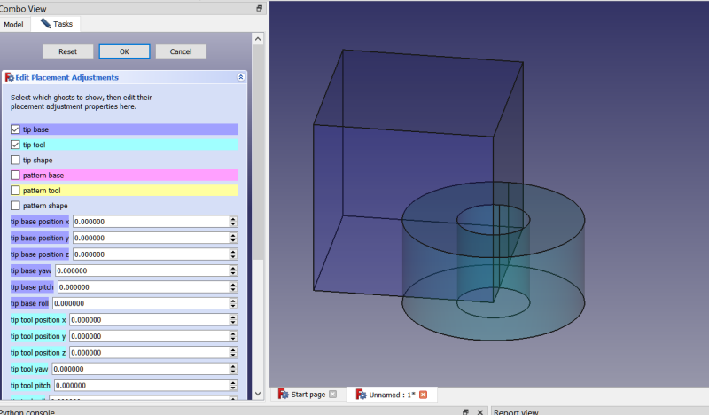

Recent update to 0.2021.10.15 breaks existing models made with earlier versions.  Delete the objects in existing files before updating and restarting or else they won't delete.  Alternatively, delete pdwrapper.py (it will be rebuilt when you run the macro again) and then restart, and then delete the objects before running the macro again.

# Macro PDWrapper

With PDWrapper you can:

* Use non-Part Design objects inside Part Design bodies, including links
* Dynamically enable/disable solid features in the Part Design tree: <a href="examples/pdwrapper_dynamic_support_example.FCStd">download example</a>
* Transform Part Design features into other types: e.g. transform a threaded Hole into a threaded rod
* Create a new type primitive in addition to Additive and Subtractive: Common (intersection) primitives, along with XOR types
* 3D scaling of Part Design features or wrapped solids
* 3D offsetting of solid features
* 3D offset / scale and cut away the original, creating a Thickness without an open face.
* Use objects in pattern features (e.g. polar patterns) that would not otherwise work with them
* Make a linear pattern of a linear pattern without using multi-transform
* Use Draft Arrays of solid objects in Part Design
* Use Draft Arrays of sketches in Part Design <a href="examples/pdwrapper_draft_array_of_sketches_example.FCStd">Example</a>
* When PDWrapper object is the Body's Tip it can have multiple solids (generates warning)
* Use Mesh objects directly in Part Design

## Brief Examples
Look in the examples folder for these files.
#### Dynamic Solid Features
Example of using a PDWrapper None type to dynamically enable/disable certain features in the tree, removing them from the solid feature chain.  When the height of the Additive Box falls below a certain threshold value the support structure isn't used in the model. 
 
 
 
#### Draft Arrays / Additive Holes
Example of using PDWrapper to use a Draft Array of sketches and also how to convert an array of Holes into threaded rods by wrapping it inside an Additive type (the PDW_Add object) : 
 

 
 
#### Part WB Variable Fillets
Here we use a Part Workbench variable fillet wrapped inside a PDWrapper Common Additive type. 
 
 
 
And here the same object as above, but this time imported as type XOR Additive: 
 
 
 
#### Mesh Objects
Importing a mesh object directly into a Part Design body using PDWrapper Additive type.  The wrapper object does the conversion to a solid automatically. 
 
 
 
#### Curves WB Sketch on Surface (requires Curves WB Addon to be installed)
Solid objects from other workbenches are easily incorporated in Part Design bodies using a PDWrapper to encapsulate them.  In this <a href="examples/pdwrapper_curves_sketch_on_surface_example.FCStd">example</a> a Sketch on Surface object from Curves Workbench is encapsulated in a PDWrapper Subtractive type so it cuts the text from the Additive Cylinder. 
 
 
 

## Overview

Part Design Wrapper object.  Encapsulates objects created outside Part Design for use inside Part Design bodies in FreeCAD.  For example, if you wish to use a Part workbench primitive, such as a Tube object in a Part Design model you can add it to the active body by selecting it and running the macro.  The macro creates a PDWrapper feature python object to encapsulate the Tube and allow it to work in the Part Design body.  In a new body the tree would look like this:

<pre>
Body
    Origin
    Tube
    PDW_Add (Tube)
</pre>

While the idea behind creating this was to use it with non-Part Design objects, such as Part workbench solids, it has evolved into also being quite useful for wrapping earlier Part Design native features in the Part Design tree.  For example, we can wrap an Additive Box inside a Common (Additive) PDWrapper and turn it into a Common (intersection) Box, or turn a threaded Part Design Hole feature into a threaded rod.  Or, we can wrap a previous feature inside a "None" type PDWrapper and disable it, along with all the other features between it and the PDWrapper in the tree.  What's more, we can dynamically (via Expressions) enable/disable a PDWrapper and the object it encapsulates.  For example, if a model is above a certain height it might require some support structure.  With the PDWrapper's Enable property we can decide whether to include the support based on the height property. 
 
This is a very powerful macro with many capabilities, including 3D offsetting and scaling.  It is complicated, make no mistake, but if nothing else just in learning to master this macro you will gain insights into the Part Design workbench and how it works.

## Icon
<a href="pdwrapper.svg">Download</a> the toolbar icon: 

## Installation
PDWrapper is now installable in the addon manager.  On first run it will offer to create another file: pdwrapper.py in the same folder.  This new file is needed in order to import the class definitions from it upon restarting FreeCAD and loading a document containing a saved PDWrapper object.  If it is not created the macro will still work, but upon restarting the PDWrapper objects stored in a document will be broken.

## Usage
Select the object to encapsulate and run the macro.  The macro will create the PDWrapper object and put it and the object being encapsulated into a Body, of one exists.  If there is no Body in the active document the macro will exit with an error message without creating the PDWrapper object.  If there is only one Body object, then the PDWrapper and the Linked Object will go into that Body.  If there are more than 1 Bodies in the document, then the active body will be used, if one is active.  If no Body is active, then a dialog will pop up asking the user to select the Body. 
 
Other dialogs will follow.  You will be asked the desired PDWrapper type to create and where to put the PDWrapper in the Body.  Each of these decisions will impact how the object works.  Often is the case the functionality will depend on which feature is ahead of it in the tree.  And the various PDWrapper types will have different default operation modes.  For example an additive type will fuse with existing material while subtractive types will cut from existing material. 
 
It also matters if the object being encapsulated is a native Part Design feature or if it originates from outside Part Design.  There will be subtle differences in the behavior of the object relative to other objects in the tree.  Also, by default, the object will not claim as children native Part Design features in order to preserve the linear nature of the tree. 
 
## Understanding Part Design
It's important to understand Part Design and how it works to make proper use of the PDWrapper objects. The Body will have a Tip property (but sometimes this can be NULL).  The feature that is the Tip will be the Body's shape, the shape it exposes to tools outside of Part Design.  For example, if you use the Body in a boolean operation in Part workbench, such as to cut it from another object, the Tip shape is what is used in the boolean operation.  Each feature in the Body (example: Pad, Pocket, Additive Cylinder, Fillet) is a solid object that is fused with (or in the case of Subtractive types, cut from) the previous solid.  They're all connected in a chain culminating in the final solid feature, which is the Tip (usually).  Non-solid objects may also reside in the Body, such as Sketches, Datum Planes, ShapeBinders, but they do not form part of this chain, at least not directly as solids. 
 
Suppose you have the following model: 
 
<pre>
Body
    Origin
    Pad
        Sketch
    Pocket
        Sketch001
    Fillet
    Box (Additive Box)
</pre>
The Pad's shape is an extrusion of Sketch.  The Pocket's shape is an extrusion of Sketch001 that has been cut from Pad's shape.  Fillet's shape is a dressup or modification of Pocket's shape.  Box's shape is a cube that has been fused with Fillet's shape.  Each solid feature is a link the solid feature chain connecting the first solid to the last.  We must take care not to unintentionally break any link in this chain.  PDWrapper objects have a Shape Manager that automatically manages the PDWrapper's role in the solid feature train, for example, fusing its shape with the feature ahead of it in the tree.  But you can turn off the Shape Manager by setting Shape Management to Manual. 
 
PDWrapper objects accomplish this feat of importing non-Part Design objects into Part Design bodies by integrating the encapsulated object with the previous solid feature either by fusing (in the case of additive types) or by cutting (in the case of subtractive types) to/from said previous solid feature.  For example, suppose you wish to add a Part Workbench Tube to the above Body, and you want to place it as an additive feature after the Pad and before the Pocket.  This is doable with a PDWrapper.  You would select the Tube and run the macro.  Select the Body, if applicable, select the Additive type, Select the Pad as the feature to come before the PDWrapper object.  The PDWrapper will take the Tube's shape and fuse it with the Pad's shape and present this fusion as its shape.  Pocket will adjust automatically and cut its shape from PDWrapper.  In this manner PDWrapper has added itself as a new link in the chain.  Nothing else uses the Tube directly.  All interfacing is done with its agent/proxy, the PDWRapper. 
 
You have control over how this is done.  The PDWrapper's shape is what I have called the Tip Shape.  This is the shape the Body inherits and uses if the PDWrapper is the tip.  Otherwise, the next feature bases itself on this Tip Shape.  There is a recipe for creating this Tip Shape.  2 shapes are used with a boolean operaton.  Tip Base and Tip Tool are used in a boolean operation called Tip Operation.  Tip Base should ordinarily be the previous solid feature.  Tip Tool should ordinarily be the encapsulated object's shape, in the above example, the Tube.  The Tip Operation in this case is "Fuse".  The Tip Tool (Tube) is fused with the Tip Base (Pad) to produce the Tip Shape for the PDWrapper.  Other boolean operations are available for the Tip Operation: "Fuse", "Cut", "Common", "XOR", and "None".  Note: If Tip Base is empty (such as when the PDWrapper is the first object) then the Tip Operation is ignored and simply the Tip Tool is used for the shape. 
 
There is another shape that the PDWrapper object provides.  This one I have called the Pattern Shape.  It is the shape used when making a pattern (array) feature, such as a linear pattern or a polar pattern.  Ordinarily, the Pattern Shape (a hidden property called AddSubShape) is simply the encapsulated object's shape, but you have complete control of the recipe for making this shape, too.  Pattern Base is usually the encapsulated object (property name: LinkedObject).  Pattern Tool normally is empty.  And Pattern Operation can be the same operations as available to the Tip Operation.  The pattern tool (example: polar pattern) will use the shape created with the Pattern Shape recipe for making its copies.  Note: the Pattern Operation has no bearing on how the pattern tool creates the copies.  For additive types it will fuse the Pattern Shape with existing material, and for subtractive types it will cut with the Pattern Shape.  There is no way for us to tell the polar pattern which boolean to use except during PDWrapper creation where we can choose either the additive or the subtractive types.  (None types cannot be used in patterns, but they are powerful in their own ways.) 
 
If you can grasp the above concepts you should be able to make use of PDWrappers in your workflow. 
## PDWrapper Types
There are several options for the type of PDWrapper object.  The object type must be selected during creation time because it cannot be changed dynamically later.  If later you wish to change PDWrapper types you will need to delete the object and create a new one, but in some instances the necessary changes can be made dynamically.  For example, if you create a common additive type you can easily change it to additive or XOR additive by changing the recipes for making the Pattern Shape and the Tool Shape.  But if you create a common additive type you cannot later change it to a common subtractive type.  This must be done at object creation time. 
### Additive
This PDWrapper type adds to (fuses with) the previous solid feature in the Body.  If it is used in a Part Design pattern feature, such as in a polar pattern feature, the copies produced will add to the existing geometry.  The Tip Shape recipe is to fuse the previous solid feature with the encapsulated object.  The Pattern Shape recipe is to simply use the encapsulated object's shape.  This is probably going to be the most commonly used type. 
### Subtractive
This PDWrapper type cuts the encapsulated object from the previous solid feature.  It should not be the first solid feature in the tree because there is nothing ahead of it to remove material from.  The Tip Shape recipe is to cut the Tip Tool (encapsulated object) from the Tip Base (previous solid feature) with a boolean cut.  The Pattern Shape recipe is simply to present the shape of the encapsulated object.  Note: we don't need to use a Cut as the Pattern Operation.  We're building the tool to use in the pattern, not making the cut at this time.   The pattern tool, such as a linear pattern, will cut the Pattern Shape from existing material when making the pattern.  For example, the Tube discussed above, if wrapped with a Subtractive PDWrapper, and then patterned with the linear pattern tool would cut material away with each copy.  Care should be taken, of course, not to leave material unconnected (multiple solids) to the rest of the produced shape. 
### Common (Additive)
The PDWrapper type performs boolean Common with the previous solid feature and the encapsulated object for the Tip Shape.  For the Pattern Shape the recipe is the same.  I'll discuss the various boolean operation types in more detail below.  Because it's an additive type the Pattern Shape gets fused with existing material even though the 2 shapes are created using Common booleans.  FreeCAD does not have Common boolean pattern tools, they are either additive (fuse) or subtractive (cut).  We can get around this limitation by encapsulating a Draft Array inside a Common Additive type.  The caveat here is that single solid limitation.  Part Design has additive and subtractive primitives, but no Common primitives.  Well, it does now!  We can remedy this by using Part workbench primitives encapsulated within Common Additive or Common Subtractive PDWrapper types. 
### Common (Subtractive)
This is similar to Common (Additive) except instead of adding material during pattern creation, FreeCAD will remove material.  The recipes for Tip Shape and Pattern Shape are the same.  The only difference is when using a pattern tool where the copies are cut from existing material rather than added to it. 
### XOR (Additive)
Here we use the XOR boolean (exclusive or).  The recipes for XOR and Common types are the same except XOR is used in place of Common for the boolean operations.  I'll discuss boolean operations in a bit more detail below.  I'm really not sure how useful the XOR types will be, but they were easy enough to add and I trust users will find creative ways to make use of this tool. 
### XOR (Subtractive)
Subtractive version of XOR (Additive).  Only difference is tool patterns will remove material rather than add material. 
### None
The humble None type cannot be used in Pattern features, but it offers some powerful capabilities nonetheless.  It can be used to dynamically enable/disable other features in the solid feature chain.  See the dynamic support example.  Usage: encapsulate the solid feature at the top of the tree that you want to be able to dynamically enable/disable and when placing the PDWrapper None type in the tree, put it immediately behind the last solid feature you wish to be able to dynamically enable/disable.  All the features between (an including) the encapsulated feature and the one immediately above the PDW_None object will not be part of the solid feature chain when the PDW_None.Enabled property is 1 (enabled), and part of the chain when Enabled is 0 (disabled). 
None types also can be used to encapsulate objects that won't be used directly as solids in the feature chain, for example 2D objects, arrays of 2D objects, solids you want to use as references such as sketch attachments.  The PDWrapper None type can be turned on or off via the Enabled property or by double clicking it in the tree view.  Other PDWrapper types also make use of the Enabled property.
### Boolean Operations
These are called boolean operations because they employ boolean logic in their algorithms, such as AND, OR, NAND, XOR, and NOT.
#### Common boolean
The Common boolean operation is sometimes called intersection.  In boolean logic terms it is a boolean AND operation.  For there to be material returned from the operation at a given coordinate there must be material at that coordinate in both the Base shape AND the Tool shape. 
#### Fuse boolean
Fusing is a logical OR.  If Base shape has material OR Tool shape (or BOTH) has material at a given coordinate then material will be at that coordinate in the result.  This is also sometimes called a Union or Fusion. 
#### Cut boolean
With the Cut operation you have (I think) logical NOT AND or NAND.  Base shape material at a given coordinate AND NOT Tool shape material at that same given location in order for there to be material in the result.
#### XOR boolean
XOR is eXclusive OR meaning matieral is returned in the result where either the Base Shape has material OR the Tool Shape has material but NOT BOTH.  It might help to think of this as the OPPOSITE of Common.  Where the Common removes all material except intersecting material, XOR removes only intersecting material.  It differs from a Cut because material from the Tool Shape is retained with XOR whereas with a Cut it is not because all of the tool material is removed.  Boolean XOR will have limited use in Part Design due to the single solid limitation.  
## Properties
Many properties are hidden by default in order to clean up the interface so it is not so intimidating / confusing / messy.  Offset, Scale, and Mesh related properties are shown/hidden in the User Interface section.
## Mesh
Meshes can be encapsulated with PDWrapper objects, too.  The Part Workbench tool to create shapes from meshes is not parametric, but this one is.   But currently if the Mesh object changes he solid is not rebuilt automatically.  Mesh objects rarely change, but when they do you must manually trigger a rebuild of the shape.  You can do this by changing the tolerance value from the current value and back again or toggle the Mesh Refine property, discussed in the next section, to trigger the rebuild.  The reason for this is rebuilding the mesh shape can sometimes take a long time to do, so we don't want to rebuild every recompute. 
### Mesh Tolerance (float constraint)
In creating the solid from the mesh a tolerance value is used the same way a tolerance value is asked for in the Part workbench Create shape from mesh tool. The wiki is silent as to exactly what this property does.  My understanding is it relates to how the facets are sewn together, perhaps for removing gaps between facets.  If you change the Mesh Tolerance property the solid is rebuilt.
### Mesh Refine (boolean)
Mesh objects are in reality triangles connected together to form faces (sometimes called facets).  They are, quite frankly, ugly monstrosities.  The Mesh Refine property will usually remove some, but rarely all, of the extra triangles.  This is not to be confused with the Refine property all Part Design additive and subtractive features have.  The Mesh is refined before it is returned as a solid shape by the mesh conversion algorithm.  The PDWrapper will use the Tip Shape recipe to fuse/cut/whatever this solid with the previous solid feature, which might leave unrefined edges, which can be taken care of with the Refine property.  It should be noted that mesh objects are often downloaded from model sharing services, such as thingiverse, and there is need to modify them in one way or another.  The problem is often these mesh objects are defective.  Garbage in, garbage out.  Some might be so defective they cannot be converted into a shape or they might fail with boolean operations. 
 
## PDWRapper
### Body (string)
This is the name of the Body object containing this PDWrapper and encapsulated object. 
 
### Claim Children (boolean)
If true the PDWrapper object claims the encapsulated object as a child in the tree view.  Default is true.  You can toggle this from true to false and back again to see its effect.  If Claim Children is true and if the PDWrapper object is deleted, then it will remove the encapsulated object from the Body (unless the encapsulated object is a Part Design feature or a 2D object).  If Claim Children is false, then the encapsulated object is left in the Body.  So, this can be a convenient way to put something into a body.
### Enabled (boolean)
Default: True.  If set to False it disables the PDWrapper object by passing it's base feature's shape (the feature ahead of it in the tree) as its own shape to the next feature in the tree.  This allows for dynamically changing which objects are part of the model, which can be a very powerful tool.  For example, set it to False in a spreadsheet if a certain property is less than some value. 
### Linked Object (link)
This is the encapsulated object.  Other link properties will typically also point to this object, example Tip Tool. 
### Shape Management (enumeration)
Default: "Automatic".  Options: "Automatic", "Manual".  In Automatic mode the Tip Base, Tip Tool, Pattern Base, Pattern Tool, and a few other properties are managed for you automatically by the Shape Manager when the tree changes, for example if the object is moved within the tree or if another object ahead of it in the tree is deleted.  In Manual mode you must manage this yourself.  In Manual mode you have more control because in Automatic mode some of your property changes might be undone. 
### Type (string) (readonly)
This is the feature python type used in creating the PDWrapper object.  This must be done at creation time when the base class is selected.  If this is "Additive" it means the PDWrapper object is of type PartDesign::FeatureAdditivePython.  If "Subtractive", PartDesign::FeatureSubtractivePython.  If "None", PartDesign::FeaturePython.  If this is "None" then the PDWrapper object cannot be used as the base for a pattern tool, such as linear patterns.  (In such cases, some properties related only to patterns will be hidden.  If "Additive" the pattern feature will fuse the copies with existing material.  If "Subtractive" the pattern tool will cut the copies from existing material.  If "None" you can't use the wrapper in patterns. 
### Version (string)
The version of PDWrapper macro used to create this PDWrapper object.  It need not necessarily be the same version as currently installed (unless some change I made breaks existing models, which happens from time to time early in development). 
## Part Design
### Refine (boolean)
This is a property you will most likely already be familiar with.  All additive/subtractive Part Design features have this property.  The None type does not, but we add it to them in the PDWrapper group. 
## Pattern Shape
Pattern Shape is the shape used by pattern tools, example: polar pattern, in making copies.  This shape is the result of a boolean operation (Pattern Operation) using Pattern Base and Pattern Tool. 
### Pattern Base (link)
Base shape used in the boolean operation to create the Pattern Shape. 
### Pattern Operation (enumeration)
Boolean operation used to create Pattern Shape.  Options are None, Cut, Fuse, Common, XOR.  In some cases this is managed by the Shape Manager.  Set ShapeManagement to Manual if it is getting changed from where you have tried to set it. 
### Pattern Tool (link)
Tool shape used in the boolean operation to create the Pattern Shape. 
### Use Pattern Base Add Sub Shape (boolean)
Default: False.  If True the Pattern Base object's AddSubShape is used in place of its Shape in all operations.  As an example, if you have a model with a Pad and an Additive Box:
<pre>
Body
    Pad
        Sketch
    Additive Box
    PDW_Add (Box)</pre>
In this example Box's Shape property is the fusion/union of the Pad and the Box, and it's AddSubShape property is just the Box itself.  If Use Pattern Base Add Sub Shape is True, then only the Box itself is used in the Pattern Operation. 
### Use Pattern Tool Add Sub Shape (boolean)
Same as Use Pattern Base Add Sub Shape, except applied to the Pattern Tool instead of the Pattern Base. 
## Pattern Offset
### Pattern Base Offset (float)
Default: 0.0  If other than 0.0, the Offset is applied to the Pattern Base object.  Pattern Base is typically the previous solid feature, but it can vary based on the type of PDWrapper created and the type of object being wrapped.  The Pattern Base property is controlled by the Shape Manager when Shape Management property is set to True (the default). 
### Pattern Shape Offset (float)
Default: 0.0  If other than 0.0 the offset is applied to the Pattern Shape.  Pattern Shape is the shape used by the pattern tools (such as polar pattern, linear pattern, etc.) when making the arrays.  If you Right-click in the property view and choose Show All option, this shape is the AddSubShape property for those objects that support being patterned by the pattern tools.  Pattern Shape is created as a result of a boolean operation (Pattern Operation) using the Pattern Base and the Pattern Tool. 
### Pattern Tool Offset (float)
Default: 0.0  If other than 0.0, the offset is applied to the Pattern Tool object.  The Pattern Tool is typically the encapsulated object.
### Pattern Offset Cut (boolean)
Default: False.  Whether to cut the offset from the original, creating a thickness with no open faces.  Think: hollow chocolate Easter bunnies.  If the offset is greater than 0 the original shape is cut from the offset.  If the offset is inward the offset is cut from the original shape.  This property affects all of the Pattern objects: the Base, the Shape, and the Tool when they are offset.  They're either all cut or all not cut.  We could have individual Cut booleans for each object, but the property view is already too cluttered, so this is shared by all the pattern shapes: Pattern Shape, Pattern Tool, and Pattern Base. 
### Pattern Offset Join (enumeration)
Default: Arcs.  The join type for the pattern shape offset: can be "Arcs", "Tangent" or "Intersection".  My experience has been Arcs mode is the most reliable to succeed.  Offsets are difficult for FreeCAD. 
### Pattern Offset Mode (enumeration)
Default: Pipe.  The mode to use when creating the offset.  Honestly, I can't really see a difference except maybe sometimes one will succeed where the others fail.  Options: Pipe, Skin, Recto-verso. 
## Scaling
PDWrapper objects support scaling of shapes used in the 2 recipes for creating the Tip Shape and the Pattern Shape as well as scaling of Tip Shape and Pattern Shape.  Note: scales are independent of one another and can be applied multiple times.  For example, if TipTool is scaled to 2.0 and TipShape is also scaled to 2.0, then the TipTool final scale is 4.0.  Negative values may be used, which produce sometimes a mirror effect.  For better mirroring / scaling control consider encapsulating a Draft Clone of the Linked Object.  To do this, wrap the Draft Clone as one of the additive or subtractive types if it's a clone of one of the solid features in the tree.  If it's a clone of a non-Part Design object, then that object needs to also be wrapped in a None type so it uses the Body's local coordinate system and to avoid links out of scope warnings. 
## Pattern Scale
Pattern scaling only affects the model when a pattern feature is used, such as making a polar pattern.  If you are not making a pattern, then all the pattern-related properties can be ignored.  Scale defaults are all 1.0.  If scale factor is other than 1.0, then scaling is done, otherwise it is not.  Example: scale = 2.0 means the new scaled object is 2x the size of the original.
### Pattern Scale Cut (boolean)
Default: False.  If True, the original pattern shape is cut from the scaled shape if scale factor is > 1, else if scale < 1, the scaled shape is cut from the original pattern shape.
### Pattern Base Scale (float)
Applies only to Pattern Base object.  Note: the object itself isn't scaled.  Instead a copy of its shape is made and that copy is scaled during production of the Pattern Shape.
### Pattern Shape Scale (float)
Applies the scale to the result of the Pattern Operation.
### Pattern Tool Scale (float)
Applies the scale to a copy of the Pattern Tool object.
## Tip Scale
Scaling can be applied independently to the 3 Tip shapes:  Tip Base, Tip Tool, and Tip Shape.  Tip Base is the base object used in the Tip Operation, typically the previous solid feature in the tree, aka the PDWrapper object's BaseFeature.  If Tip Base is scaled, a copy of the Tip Base is made and that copy is scaled and used in the Tip Operation.  Same for Tip Base scaling.  The Base and Tool are scaled first, and then scaling is applied to the result (Tip Shape).  If you scale Tip Base = 2.0, Tip Tool = 2.0, and Tip Shape = 2.0 you are scaling 8x because each scale is applied independently.
### Tip Base Scale (float)
Scale applied to a copy of the Tip Base shape, which is then used to create the Tip Shape.
### Tip Scale Cut (boolean)
Default: False.  If True, and if scale is other than 1.0, the original object is cut from the scaled object if scale is greater than 1.0 or the scaled object is cut from the original if scale is less than 1.0.  This basically hollows out the interior.  It's sort of a Thickness, but without the open face.  Of course, you can cut out the face, if desired, in a subsequent operation.
### Tip Shape Scale (float)
Scale applied to Tip Shape, which is the result of the Tip Operation, a boolean operation performed on the Tip Base and the Tip Tool.
### Tip Tool Scale (float)
Scaled applied to the Tip Tool, or technically to a copy of the Tip Tool shape.  The Tip Tool object itself is unchanged.  The scaled copy is then used in the Tip Operation to create the Tip Shape.
## Tip Offset
Where scaling is a percentage (1.0 = 100%) offsetting is a dimension.  The default is 0.0, which is no offsetting at all.  An Offset value of 1.0 would mean offset by 1 mm.
### Tip Offset Cut (boolean)
Default: False.  Whether to cut the offset from the original or vice-versa, creating a hollow solid, like a thickness but without an opening into the interior.  See also Tip Scale Cut, which works on scales instead of offsets. 
### Tip Shape Offset Join (enumeration)
Default: Arcs.  The join type for the tip shape offset: can be "Arcs", "Tangent" or "Intersection".  My experience has been Arcs mode is the most reliable to succeed.  Offsets are difficult for FreeCAD. 
### Tip Shape Offset Mode (enumeration)
Default: Pipe.  The mode to use when creating the offset.  Honestly, I can't really see a difference except maybe sometimes one will succeed where the others fail.  Options: Pipe, Skin, Recto-verso. 
### Tip Base Offset (float)
Default: 0.0  If not 0.0 the offset is applied to the Tip Base prior to using it in the Tip Operation (along with Tip Tool) to create the Tip Shape, the shape you see in the 3D view and the shape of the Body the PDWrapper object is the Body's Tip object. 
### Tip Shape Offset (float)
Default: 0.0  Tip Shape is the shape created when the boolean Tip Operation is applied to the Tip Base and the Tip Tool.  The Tip Base is typically the previous solid in the tree while the Tip Tool is the objected being wrapped.  If this property is other than 0.0, then the offset is applied to the result. 
### Tip Tool Offset (float)
Default: 0.0  If any value other than 0.0 the Tip Tool is offset by the amount in the Tip Offset property.
## Placement Adjustments
Sometimes the shapes are not oriented as we expect them to be and need to be adjusted.  Sometimes we might want to adjust them even when they are in the expected orientations.  These Placement properties are used in addition to the shapes' placements.  For example, Pattern Base Placement is not for the Pattern Base object it is an offset to be used with the copy of the Pattern Base object's shape that is used in creating the Pattern Shape, which is the shape used by the pattern tools, such as linear pattern feature. 
### Edit Placement Adjustments (boolean trigger)
Default: False.  Toggle it to True to bring up the Placement Adjustment editor, which it does and then sets itself back to False.  This dialog can also be accessed by right clicking the PDWrapper in the tree and selecting Edit Placement Adjustments from the context menu. 
 
In this screenshot there is a Part Design Additive Box (tip base) and a part workbench tube primitive (tip tool).  I call these shapes "ghosts" because of their transparencies.  Each shape is color-coded to match (more or less) the color of the dialog fields related to that shape.  Each can be enabled/disabled using the appropriate checkbox.  If something isn't lined up properly or if you just want a slightly different alignment you can edit the placement adjustment property in the dialog.  The ghosts are actually temporary objects in the document that are not displayed in the tree.  They are deleted when the dialog is closed.  If through some error they are not deleted you can safely delete them manually.  They are rebuilt each time the dialog is opened.  Pressing OK accepts the current configuration and closes the dialog.  Cancel resets the placements to their original values when the dialog was first opened and closes the dialog.  Reset sets all the placements to 0 and leaves the dialog open. 
 
 
### Pattern Base Placement (Placement)
### Pattern Tool Placement (Placement)
### Tip Base Placement (Placement)
### Tip Tool Placement (Placement)
These are placement properties applied as adjustments to copies of the various shapes, not to the objects themselves.  In the above example screenshot if we adjust the tube's placement in the z position, for example, only the shape used (a copy of the tube's shape) for that operation is moved, not the tube object itself.  You can think of these as attachment offsets that are applied not to attachments, but to shapes of objects. 
 
These are set to readonly while the editor is open and normal mode when the editor is closed.  This is because changes made inside the editor are applied to these placements, but not the other way around.  But the editor fields are updated from them when the dialog is first created.  Also, if you find the ghost objects in the document you should not try to edit their placments directly because they are only there as visual indicators for your convenience.  Their placements do not actually have any effect on the boolean operations that create the tip and pattern shapes.
## Tip Shape
Here are the properties that make up the recipe for building the tip shape.  The Tip Shape is the shape you see in the 3D view when the PDWrapper object is the visible feature.  I call it Tip Shape because it's the shape the Body presents when this feature is the Tip for the Body.  It is created using the Tip Shape recipe, which includes Tip Base, Tip Tool, and Tip Operation (the boolean to use) 
### Tip Base (link)
The object used as the base for the Tip Operation (along with the Tip Tool) in generating the PDWrapper object's Tip Shape.  I call it Tip Shape because it is the shape the Body inherits when an object is the Tip feature.  It's also the shape any features that follow in the tree will combine with to create their Tip Shape.  Tip Base is always going to be the previous solid feature by default, but you can change it if you want a different Tip Shape.  Remember, the Base has the material that the Tool will cut away.  For example, to make a round hole in a cube you would use the cube as the base and a cylinder as the tool. 
### Tip Operation (enumeration)
The boolean operation used in creating the Tip Shape.  Options are Fuse, Cut, Common, XOR, and None.  The Tip Tool object is Cut from the Tip Base object if Cut is the Tip Operaton to form the Tip Shape, for example.  If "None", then the Tip Base is returned as the shape. 
### Tip Tool (link)
The tool shape used in creating the Tip Shape.  This is ordinarily the encapsulated object.  Note: for Fuse, Common, and XOR operation types it doesn't matter which shape is base and which is tool.  Only for Cut does it matter, where the tool is the cutting tool used to remove material from the base. 
### Use Tip Base Add Sub Shape (boolean)
### Use Tip Tool Add Sub Shape (boolean)
In creating the Tip Shape you have the option of using the shapes of Tip Base and Tip Tool or some combination of their pattern shapes, the ones used when making polar patterns of the object, for example.  Basically, the Add Sub Shapes (or pattern shapes) are the objects themselves only, whereas the Tip Base or Tip Tool shapes are usually created by combining the Add Sub Shapes with previous features.  Consider this model tree, the model is an Additive Box with a hole in it created with a pocketing a sketch:

<pre>
Body
    Box
    Pocket
        Sketch</pre>
Box's Shape and its AddSubShape are the same thing, the box's pattern shape because Box is the first shape in the tree and there is nothing in front of it for it to fuse with.  Pocket's shape is the Box with the hole in it, but its AddSubShape (pattern shape) is the hole itself, or more accurately the shape of the tool created by extruding the sketch, the one used to cut the pocket.  If the sketch is just a circle then the Pocket's AddSubShape is a cylinder.  Which object you use in making the PDWrapper object's tip shape is up to you, whether it's the Box's shape or the cylinder's shape.  (Note: You might need to set Shape Management to Manual if you want to change many of these settings or else they will get reset by the Shape Manager.

## User Interface
### Show Offset Props (boolean)
Default: False.  Whether to show properties related to offsetting options.
### Show Scale Props (boolean)
Default: False.  Whether to show properties related to scaling options.
### ShowMeshProps (boolean)
Default: False (unless wrapped object is a mesh).  Whether to show properties related to mesh objects.
### Show Warnings (boolean)
Default is true.  There are warnings when the PDWrapper Tip Shape contains multiple solids, a big no no in Part Design.  But such shapes are allowed by the PDWrapper object.  They are only problematic when the subsequent operation, if any, does not reconcile this by bridging all of the disconnected shapes back together.  In Part Design *every* boolean result in the chain must produce a single contiguous solid.  PDWrappers can be a way to get around this limitation if used carefully.  The Show Warnings property, if set to false, will disable output of these and a few other warning messages, which can become annoying after a time. 

## Changelog
* 0.2021.10.17 apply offsetting and scaling to ghosts
* 0.2021.10.16.rev2 put ghosts in body so they are positioned correctly if the body has been moved/rotated
* 0.2021.10.15 create placements adjustment properties and editor
* 0.2021.10.14.rev8 add context menu enable/disable
* 0.2021.10.14.rev6 fix bug where "Type" property was being accessed before the object was fully initialized.
* 0.2021.10.14.rev3 fix bug related to installing with addon manager
* 0.2021.10.14.rev2 Put Type property in PDWrapper section
* 0.2021.10.14 Hide Offset, Scale, and Mesh properties by default (cleans up UI dramatically)
* Rearrange properties into more subgroups for better or for worse
* Create User Interface group with ShowMeshProps, ShowOffsetProps, ShowScaleProps, and ShowWarnings
* 0.2021.10.13.rev3 Changed Offset booleans to floats to allow for individual offsetting, and also enable removing a couple properties 
  since these can act as booleans by testing against 0.0.
* 0.2021.10.13.rev2 Lots of bug fixes
* 0.2021.10.12.rev2 Lots of changes since 0.2021.10.08
* Gone are the WireWrapper functions -- feature bloat -- needs to be a separate macro
* Enabled is now an Integer rather than a boolean, makes it easier to get at it for expression binding
* Double click the object to change Enabled to 0 or 1 (unless it's bound to an expression)
* Bug fixes
* Renamed / rearranged some properties for more useful grouping and to better reflect current usage
* 0.2021.10.08
* Add ability to hide wires by setting the wire order for that wire to 0
* Add ResetWireOrder trigger
* 0.2021.10.07
* Add 3D offsetting for the Tip and Pattern shapes
* Feature bloat is setting in.  It's time now to focus on fixing bugs and not adding more features.  Assuming I can resist the urge.
* 0.2021.10.06.rev2
* Show All property
* WireNNN Scale Offset property
* create / do not create file text as button labels
* 0.2021.10.05
* add Selected Only boolean trigger
* change WireNNN group names to Wire00N, Wire0NN, or WireNNN to enforce sorting order
* add Max Wires property
* 0.2021.10.04.rev5
* Add 2D offset to WireWrapper types
* 0.2021.10.04.rev4
* add reset from history option for restoring wire order
* 0.2021.10.04.rev3
* add WireOrder property for WireWrapper types
* 0.2021.10.04.rev2
* TipShapeScale is applied to the final shape rather than to individual wires since they already have individual scaling
* Use CenterOfMass if the TipShape has that attribute, else use BoundBox.Center when scaling tip shape
* 0.2021.10.04
* add facemaker capabilites to WireWrapper types
* 0.2021.10.03.rev5
* add WireWrapper type and scaling of individual wires
* 0.2021.10.03.rev4
* fix bug in None (Passthrough) type
* 0.2021.10.03.rev3
* add None (Passthrough) type
* 0.2021.10.03.rev2
* Add scaling support
* 0.2021.10.02.rev2
* fix placement issue where PDWrapper was first object in Body
* If ShapeManagement is Automatic, also manage PatternBase if PatternBase = TipBase
* remove some commented lines
* use fp.Body (name of body) rather than active body
* 
