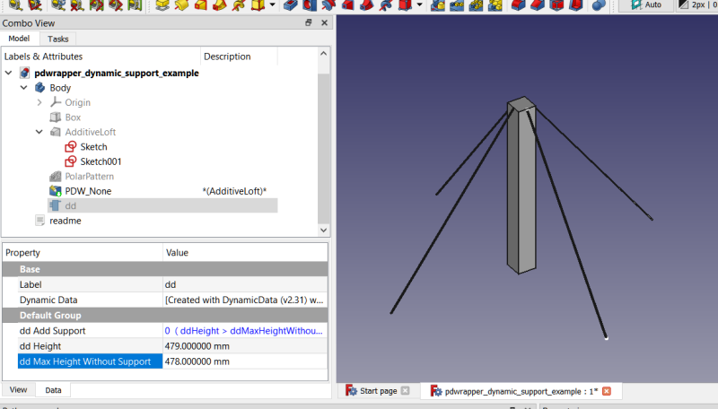
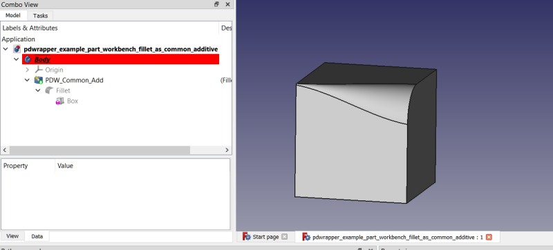

# Examples folder

## Dynamic Support Example

When using the very powerful PDWrapper None type we can dynamically enable/disable selected objects in the solid feature tree, based on some boolean variable (or something that evaluates either to 0 or 1).  In the example file change the dd object's ddHeight property to something greater or less than its ddMaxHeightWithoutSupport property.  If the height is greater a support structure is modeled, if not then the support structure isn't used. 
 
 
 

## Draft Array of Sketches Example

The draft array of sketches example wraps a draft array of sketches inside a None type.  Any non-solids should be wrapped in None types.  The PDWrapper reflects the previous solid feature's shape as its own, so FreeCAD doesn't complain about having an empty tip shape.  Use the 2D objects (in this case the Array, since it's a 2D object, being an array of 2D sketches) directly with Pad, Pocket, etc. or you may use the wrapper object if it shows as visible when the PDWrapper is made visible.  You might need to toggle the PDWrapper Enabled to 0 in some cases (double click the PDWRapper in the tree to toggle Enabled property).  Asterisks will be displayed in the tree view for disabled PDWrappers.  (In this case, since we are using the Draft Array directly, toggling Enabled has no effect.)

In the screenshot below 2 concepts are demonstrated: 1) using a None type to get an array of sketches into the body and 2) using an additive type to convert holes into threaded rods. 
 

## Part Workbench Variable Fillet as a Common Additive

Part Design has a fillet tool, but it does not at the time of this writing support variable fillets.  We can use the Part fillet tool to create a variable fillet on a Part Design feature, and then import that fillet in as a Common Additive type. 
 

